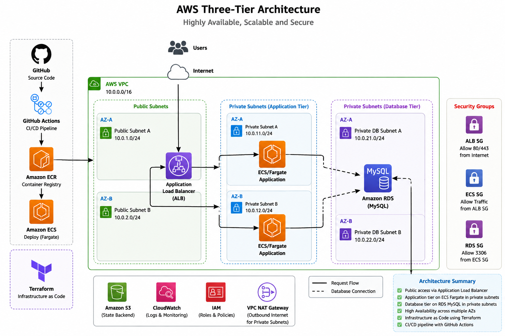

# AWS Three-Tier DevOps Project

A hands-on DevOps project demonstrating the design, containerization, deployment, and Infrastructure-as-Code implementation of a scalable three-tier application on AWS.

## Project Overview

This project demonstrates a modern AWS three-tier architecture using containerized applications, managed AWS services, and Terraform.

The architecture separates the application into:

- Presentation / Load Balancing Tier
- Application Tier
- Database Tier

## Architecture


Internet
   |
   v
Application Load Balancer (ALB)
   |
   v
Amazon ECS / Fargate
   |
   v
Amazon RDS (MySQL)

The application container image is stored in Amazon ECR and deployed through Amazon ECS.

## AWS Services Used

- Amazon VPC
- Public and Private Subnets
- Application Load Balancer (ALB)
- Amazon ECS
- AWS Fargate
- Amazon ECR
- Amazon RDS MySQL
- IAM Roles
- Security Groups

## DevOps Tools

- AWS
- Terraform
- Docker
- Git
- GitHub
- Linux
- AWS CLI

## Infrastructure as Code

Terraform is used to define the AWS infrastructure.

Terraform configuration includes:

- VPC and networking
- Subnets
- Security Groups
- Application Load Balancer
- ECS Cluster and Service
- ECS Task Definition
- ECR Repository
- RDS MySQL Database
- IAM Roles
- Terraform Variables and Outputs

## Terraform Structure

terraform/
├── provider.tf
├── variables.tf
├── network.tf
├── security-groups.tf
├── alb.tf
├── ecr.tf
├── ecs.tf
├── rds.tf
└── outputs.tf

## Terraform Workflow

Initialize Terraform:

```bash
terraform init

# CI/CD Pipeline Test
# CI/CD Pipeline Test
## Deployment Status

The application was successfully deployed and tested on AWS using ECS Fargate, Application Load Balancer, Amazon RDS MySQL, and Amazon ECR.

The CI/CD workflow was validated using GitHub Actions to build and push Docker images to Amazon ECR, followed by deployment to Amazon ECS.

The live AWS infrastructure may be decommissioned when not in use to minimize cloud costs. The infrastructure can be recreated using the Terraform configuration included in this repository.
